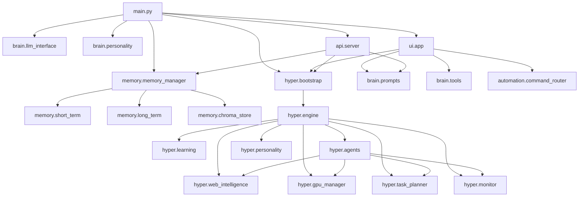

# Hyper-Intelligence Layer Report

## Architecture Report

### Existing Runtime Map

- Entry point: [`main.py`](../main.py)
- Core LLM layer: [`brain/llm_interface.py`](../brain/llm_interface.py)
- Memory stack:
  - Short-term RAM: [`memory/short_term.py`](../memory/short_term.py)
  - Long-term SQLite: [`memory/long_term.py`](../memory/long_term.py)
  - Vector memory: [`memory/chroma_store.py`](../memory/chroma_store.py)
  - Coordinator: [`memory/memory_manager.py`](../memory/memory_manager.py)
- Tool and automation layer:
  - Command router: [`automation/command_router.py`](../automation/command_router.py)
  - Tool dispatcher: [`brain/tools.py`](../brain/tools.py)
- UI and API:
  - Desktop UI: [`ui/app.py`](../ui/app.py)
  - FastAPI server: [`api/server.py`](../api/server.py)
- Model and behavior helpers:
  - Prompt assembly: [`brain/prompts.py`](../brain/prompts.py)
  - Personality: [`brain/personality.py`](../brain/personality.py)
  - Adaptive personality: [`brain/personality_engine.py`](../brain/personality_engine.py)
  - Multi-model router: [`brain/multi_model.py`](../brain/multi_model.py)
  - Self-correction: [`brain/self_correction.py`](../brain/self_correction.py)

### Hyper Layer Additions

- Hyper engine: [`hyper/engine.py`](../hyper/engine.py)
- Bootstrap helpers: [`hyper/bootstrap.py`](../hyper/bootstrap.py)
- Web intelligence: [`hyper/web_intelligence.py`](../hyper/web_intelligence.py)
- GPU manager: [`hyper/gpu_manager.py`](../hyper/gpu_manager.py)
- Monitor: [`hyper/monitor.py`](../hyper/monitor.py)
- Task planner: [`hyper/task_planner.py`](../hyper/task_planner.py)
- Multi-agent orchestrator: [`hyper/agents.py`](../hyper/agents.py)
- Assistant personality engine: [`hyper/personality.py`](../hyper/personality.py)
- Learning engine: [`hyper/learning.py`](../hyper/learning.py)
- Optional memory wrapper: [`hyper/memory_manager.py`](../hyper/memory_manager.py)

### Dependency Graph

### Safe Extension Points

- `get_system_prompt(...)` remains the canonical prompt builder.
- `MemoryManager.get_context_for_llm(...)` is still the primary memory retrieval hook.
- `ToolDispatcher.dispatch(...)` remains the automation gateway.
- `HyperIntelligenceEngine.get_context_enhancement(...)` adds context only when enabled.
- `HyperIntelligenceEngine.enhance_response(...)` post-processes responses without replacing the base LLM.
- `api.server.inject_services(...)` is the safe service injection point for optional features.
- `ui.app.JosephApp` now accepts an optional `hyper_engine` without changing default behavior.

## Change Summary

- Added an opt-in hyper layer controlled by `ENABLE_HYPER_LAYER`.
- Implemented new additive modules for GPU detection, web research, planning, monitoring, orchestration, and assistant-style behavior.
- Wired the hyper layer into `main.py`, `ui/app.py`, and `api/server.py` behind feature gating.
- Added in-memory fallbacks for restricted environments so the new subsystems do not crash when SQLite file writes are unavailable.
- Hardened logging so startup falls back to console-only logging when file logging is not writable.

## New Module Documentation

### `hyper.bootstrap`

- `hyper_enabled()`: reads the opt-in flag.
- `create_hyper_engine(...)`: attaches and starts the hyper layer when enabled.
- `get_context_enhancement(...)`: safely fetches prompt context.
- `enhance_response(...)`: safely post-processes a response.
- `shutdown_hyper(...)`: stops the layer without raising.

### `hyper.engine`

- Coordinates sub-engines.
- Tracks goals.
- Adds context before response generation.
- Records interactions for learning.

### `hyper.learning`

- Versioned knowledge storage.
- Web and interaction ingestion.
- SQLite-backed with in-memory fallback.

### `hyper.web_intelligence`

- Multi-source search.
- Cached synthesis.
- Source formatting and confidence estimation.
- Optional memory storage.

### `hyper.gpu_manager`

- Detects CUDA, TensorRT, DirectML, ROCm, and OpenCL.
- Always falls back to CPU if needed.

### `hyper.monitor`

- Tracks CPU, memory, API latency, model quality, and response quality.
- Exposes a diagnostics snapshot.

### `hyper.personality`

- Wraps existing personality logic.
- Suggests next actions.
- Builds assistant-style modifiers.

### `hyper.task_planner`

- Breaks goals into steps.
- Persists plan state.
- Reports progress and next steps.

### `hyper.agents`

- Coordinates research, planning, reasoning, memory, and optimization agents.
- Can run one agent or combine several outputs.

### `hyper.memory_manager`

- Optional wrapper over the existing memory manager.
- Adds retrieval bundles and cleanup helpers.

## Test Results

Executed in the workspace venv:

- `tests/test_hyper_layer.py`: 8 passed, 0 failed
- `import main`: passed after logging fallback update
- `import api.server`: passed

Notes:

- Full GPU/load/network-dependent tests were not run in this restricted environment.
- The new modules were designed to degrade safely when GPU or network features are unavailable.

## Migration Guide

1. Keep the current app as-is for normal use.
2. Set `ENABLE_HYPER_LAYER=true` in `.env` to opt into the new layer.
3. Optionally tune:
   - `ENABLE_HYPER_LEARNING`
   - `ENABLE_HYPER_WEB`
   - `ENABLE_HYPER_GPU`
   - `ENABLE_HYPER_AGENT_ORCHESTRATION`
4. Restart the app.
5. Review `api/server.py` diagnostics at `/system/diagnostics` if the API server is running.

## Rollback Plan

1. Set `ENABLE_HYPER_LAYER=false` or remove the flag.
2. Restart the app.
3. The base assistant will run exactly as before because the hyper layer is additive and optional.
4. If a subsystem misbehaves, disable only the related feature flag instead of removing code.
5. The logging fallback and in-memory DB fallbacks stay in place to reduce startup failures.
