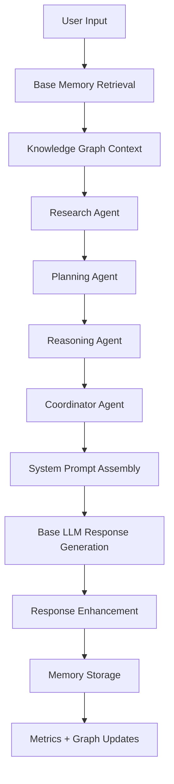

# Hyper Layer Phase 2 Report

Backup snapshot created before changes:
- `C:\Users\Grayson\Desktop\Joseph\backups\20260529-234044`

## 1. Hyper Layer Audit Report

| Module | Purpose | Status | Runtime usage | Missing or limited functionality | Recommendation |
|---|---|---:|---|---|---|
| `hyper/bootstrap.py` | Safe opt-in entry helpers | Fully implemented | Called by `main.py`, `ui/app.py`, `api/server.py` | None significant | Keep as the stable integration shim |
| `hyper/engine.py` | Top-level coordinator | Fully implemented for current scope | Active when `ENABLE_HYPER_LAYER=true` | Can still expand deeper policy routing and adaptive scoring | Use as the main orchestration surface |
| `hyper/learning.py` | Versioned knowledge ingestion | Fully implemented | Attached by the hyper engine, stores interactions | No destructive self-modification by design | Keep human approval boundaries |
| `hyper/web_intelligence.py` | Multi-source research and synthesis | Fully implemented for additive usage | Called from the hyper engine and agent orchestrator | Network dependent, so results can be empty offline | Keep cache-first and fail-soft behavior |
| `hyper/gpu_manager.py` | GPU detection and benchmarking | Fully implemented | Used by diagnostics, orchestrator, and dashboard | GPU reporting is best-effort and environment dependent | Keep fallbacks and benchmark caching |
| `hyper/monitor.py` | Health and performance metrics | Fully implemented | Used by engine and dashboard | CPU/GPU metrics depend on optional libraries/hardware | Continue recording more metrics over time |
| `hyper/personality.py` | Assistant-style response guidance | Fully implemented | Used by engine and prompt enhancement | Could learn richer preferences from feedback loops | Keep as a lightweight style layer |
| `hyper/task_planner.py` | Persistent task planning | Fully implemented | Used by orchestrator and dashboard | LLM planning remains optional | Keep heuristic fallback |
| `hyper/agents.py` | Multi-agent collaboration | Fully implemented | Used by the hyper engine | Additional specialized agent roles can be added | Keep structured message logging |
| `hyper/knowledge_graph.py` | Persistent graph reasoning | Fully implemented | Used by hyper turn preparation and dashboard | Graph extraction is heuristic, not ontology-driven | Improve entity extraction over time |
| `hyper/improvement_analyzer.py` | Self-improvement reporting only | Fully implemented | Used by dashboard and diagnostics | Static analysis only, no code changes | Keep approval-only policy |
| `hyper/memory_manager.py` | Optional memory wrapper | Partially implemented | Available as an extension point | Not yet used as the primary runtime memory object | Either wire it in later or keep as compatibility helper |

### Disconnected or lightly used pieces

- `hyper/memory_manager.py` is currently an optional wrapper, not the default runtime memory object.
- `HyperIntelligenceEngine.research()` and `run_agent_task()` are programmatic entry points, while the main runtime now uses `prepare_turn()` for the full pipeline.
- `hyper/bootstrap.get_context_enhancement()` and `enhance_response()` remain compatibility helpers and are still used in the runtime path.

## 2. Gap Analysis

### What was previously missing

- The hyper layer had modules, but the runtime did not exercise a full hyper pipeline.
- There was no persistent knowledge graph.
- There was no self-improvement analyzer.
- The dashboard was API-only and not real-time.
- Metrics did not include response time, throughput, or GPU utilization details.
- Multi-agent collaboration was present, but not structured or logged well enough for diagnostics.

### What is now covered

- Pre-response hyper orchestration now runs through memory retrieval, knowledge graph context, research, planning, reasoning, and coordinator synthesis.
- The response path is still additive: the base model still produces the final answer.
- Dashboard data is now exposed through live polling endpoints.
- GPU status and benchmarking are available, with graceful fallback.
- Memory and graph data can survive restarts when the environment allows persistence, and now fall back safely when it does not.

### Remaining improvement opportunities

- Better entity extraction for the knowledge graph.
- Deeper source validation heuristics for research.
- More granular token-level timing if the LLM backend exposes it.
- UI embedding of the dashboard inside the desktop app, if desired later.

## 3. Runtime Execution Diagram

### What happens at each stage

1. User input enters the normal app flow in `main.py`, `ui/app.py`, or `api/server.py`.
2. Existing memory retrieval is performed first through the current `MemoryManager`.
3. The hyper layer adds graph context from `hyper/knowledge_graph.py`.
4. The research agent runs through `hyper/web_intelligence.py`.
5. The planning agent runs through `hyper/task_planner.py`.
6. The reasoning agent runs through the LLM-backed analysis path.
7. The coordinator merges all agent outputs in `hyper/agents.py`.
8. The final system prompt is assembled and sent to the existing LLM backend.
9. The existing response is preserved and optionally enhanced by the hyper layer.
10. Memory storage and long-term updates continue through the existing memory stack.

## 4. Diagnostics Dashboard

### Endpoints

- `GET /dashboard`
- `GET /dashboard/data`
- `GET /system/diagnostics`

### Dashboard sections

- System Status
- Performance
- Agent Activity
- Memory
- Research
- GPU
- Self-Improvement

### Data included

- Hyper enabled status
- Model name
- Session ID
- Uptime
- CPU usage
- RAM usage
- GPU usage
- VRAM usage
- Response time
- Tokens per second
- Agent execution logs
- Memory counts and vector cache stats
- Research cache size
- Source counts and citations
- Improvement findings

## 5. Memory System Report

### Current state

- Short-term memory is still the conversation window.
- Long-term memory is still SQLite-backed when file access is available.
- ChromaDB remains the semantic memory path when available.
- A safe in-memory fallback was added for restricted environments so startup does not fail.

### Hyper-layer additions

- Knowledge graph memory is now available for relational context.
- Research outputs can be stored as memory.
- Hyper turn preparation automatically retrieves context before response generation.
- Memory cleanup and summarization remain additive and non-destructive.

## 6. GPU Utilization Report

### Detection

- CUDA detection via PyTorch
- NVIDIA utilization via `nvidia-smi` when available
- TensorRT, DirectML, ROCm, and OpenCL best-effort detection

### Benchmarking

- CPU matrix multiplication benchmark
- GPU matrix multiplication benchmark when CUDA is available
- Speedup reporting when both results are available

### Current behavior

- GPU failures never crash the system.
- The system falls back to CPU mode automatically.
- GPU metrics are surfaced in the dashboard when available.

## 7. Agent Collaboration Report

### Agents

- Research Agent
- Planning Agent
- Reasoning Agent
- Memory Agent
- Optimization Agent
- Coordinator Agent

### Collaboration model

- Agents communicate through structured messages.
- Agent results are logged with durations and metadata.
- The coordinator can return a combined structured trace.
- The runtime uses the structured trace to enrich the prompt and dashboard.

### Current limitations

- The research agent still depends on live web access.
- The planning agent is heuristic-first and LLM-assisted.
- The memory agent is context-based, not a separate storage engine.

## 8. Test Results

Executed in the workspace venv:

- `tests/test_hyper_layer.py`: 12 passed, 0 failed
- `import main`: passed
- `import api.server`: passed
- `MemoryManager()` runtime smoke test: passed after adding safe fallback

Not run here:

- Full GPU hardware benchmark validation
- Live web research against external sources
- UI click-through validation in the desktop app

## 9. Rollback Plan

1. Set `ENABLE_HYPER_LAYER=false`.
2. Restart JOSEPH.
3. The base assistant will continue to operate with the existing memory, UI, and API paths.
4. If only one subsystem causes trouble, disable the related feature flag:
   - `ENABLE_HYPER_WEB`
   - `ENABLE_HYPER_GPU`
   - `ENABLE_HYPER_GRAPH`
   - `ENABLE_HYPER_ANALYZER`
   - `ENABLE_HYPER_AGENT_ORCHESTRATION`
5. Keep the backup snapshot above until the rollout is validated.

## 10. Recommended Phase 3 Roadmap

1. Add deeper source-ranking heuristics and citation normalization for web research.
2. Embed the diagnostics dashboard inside the desktop UI as an optional tab.
3. Add richer entity extraction for the knowledge graph.
4. Add persistence for agent traces and dashboard history.
5. Improve throughput measurements with backend-specific token accounting if the LLM backend exposes it.
6. Add optional alerting for monitor warnings and repeated tool failures.
7. Add a small approval workflow for suggested improvements from the analyzer.
