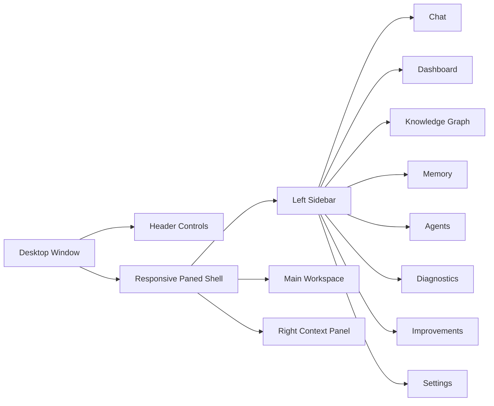

# JOSEPH AI Command Center UI

## Overview

The desktop app now exposes the Hyper Layer through a tabbed command center built into the existing CustomTkinter window.

The goal of this UI is additive:

- Keep the existing chat workflow intact
- Expose the Hyper Layer visually
- Preserve the browser dashboard fallback
- Avoid heavy polling and preserve responsiveness

## Layout

The shell now uses a responsive three-region layout:

- Left sidebar: collapsible command navigation with remembered width
- Main workspace: fills remaining space and swaps between tabs
- Right context panel: optional live summary area for turn, agent, research, memory, and diagnostics context

## Tab Summary

- Chat: streaming conversation, uploads, export, turn intelligence panel
- Dashboard: system, intelligence, GPU, and memory overview
- Knowledge Graph: node canvas, search, zoom, inspection
- Memory: search, edit, pin, archive, delete
- Agents: collaboration timeline and agent log stream
- Diagnostics: CPU, RAM, GPU, response, and error metrics
- Improvements: human-review improvement suggestions
- Settings: runtime UI toggles and refresh controls

## Visual Controls

- The top header exposes quick toggles for the left sidebar, right context panel, and layout reset
- Layout state is persisted between launches
- Theme mode can be switched between dark, light, and system follow mode from Settings
- The browser dashboard remains a fallback if the desktop UI is unavailable

## Runtime Notes

- Hyper rendering is controlled by `ENABLE_HYPER_LAYER`
- UI refreshes are event-driven where possible and uses a conservative timer for live metrics
- The browser dashboard remains available at `/dashboard`

## Launch Commands

- Desktop UI: `python main.py`
- Desktop UI with Hyper Layer: `$env:ENABLE_HYPER_LAYER='true'; python main.py`
- API server: `python -m uvicorn api.server:app --host 127.0.0.1 --port 8000 --reload`

## URLs

- Dashboard: `http://127.0.0.1:8000/dashboard`
- Diagnostics: `http://127.0.0.1:8000/system/diagnostics`
- API Docs: `http://127.0.0.1:8000/docs`

## Environment Variables

- `ENABLE_HYPER_LAYER`
- `ENABLE_HYPER_LEARNING`
- `ENABLE_HYPER_WEB`
- `ENABLE_HYPER_GPU`
- `ENABLE_HYPER_AGENT_ORCHESTRATION`
- `ENABLE_HYPER_GRAPH`
- `ENABLE_HYPER_DASHBOARD`
- `ENABLE_HYPER_ANALYZER`
- `API_HOST`
- `API_PORT`

## Dependencies

- `customtkinter`
- `fastapi`
- `uvicorn`
- `chromadb`
- `networkx`
- `psutil`
- `Pillow`

## Rollback

If needed, disable `ENABLE_HYPER_LAYER` and the app will continue using the original chat path while keeping the browser dashboard fallback available.
